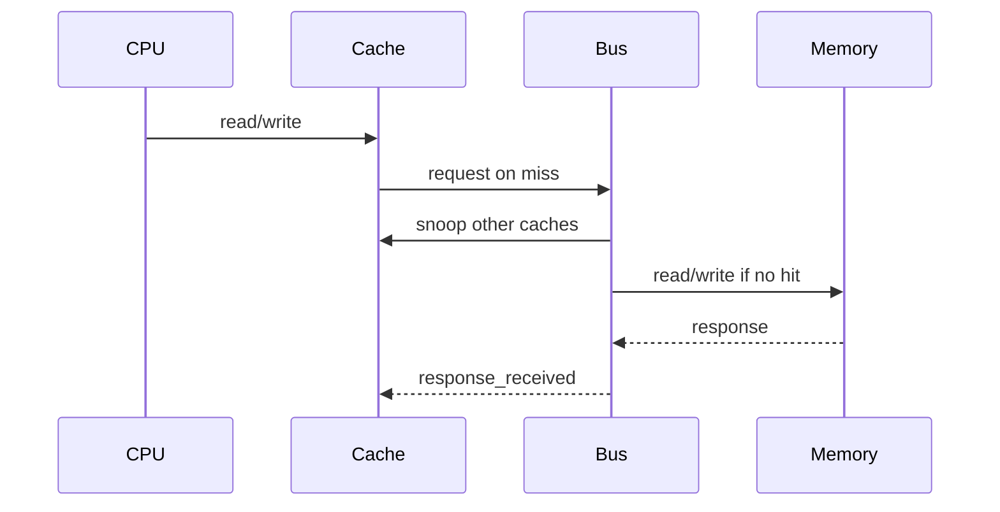

In performance engineering and HPC, writing fast software means understanding the memory hierarchy well enough that surprises feel explainable, not magical. I built a trace-driven cache simulator in SystemC to poke at that directly.

This post follows how the simulator grew: single-core L1, shared-bus multicore, a MOESI upgrade, and finally an OpenMP heat-diffusion kernel to see how software choices show up in cache-line states and bus traffic.

---

## 1. Architecture of a Single-Core L1 Data Cache

To establish a baseline, I first modeled an L1 data cache. Rather than introducing a complex module between the pre-existing CPU and Memory components, I integrated the cache logic into the Memory module. This allowed the module to simulate cache accesses first and only fall back to simulated DRAM accesses when necessary, keeping the transaction boundary clean.

### Structural Decisions & Address Decoding
I structured the cache hierarchy in C++ using clean structures to match the physical layout of hardware:

```cpp
struct CacheLine {
    uint64_t tag;
    uint32_t data[8]; // 32 bytes (8 words)
    bool valid;
    bool dirty;
};

struct CacheSet {
    CacheLine lines[8]; // 8-way associativity
    uint8_t agingBits[8]; // Track LRU state
};
```

For a baseline **32 kB cache** with **32-byte lines** and **8-way associativity**:
*   The total number of cache lines is 1024.
*   Dividing these into an 8-way associative structure yields 128 sets.
*   The address is dynamically decoded at runtime: the 5 least-significant bits index the word offset, the next 7 bits determine the set index, and the remaining bits form the tag. This parameterized approach makes it straightforward to scale up to 64-byte lines or alternate capacities.

### Cache Policies: Write-Back, Write-Allocate, and LRU
To minimize off-chip bandwidth, I implemented a **write-back** policy coupled with **write-on-allocate**:
*   **Write-Back:** Modified cache lines are only written to main memory when they are evicted, avoiding unnecessary memory traffic on frequent writes.
*   **Write-on-Allocate:** On a write miss, the entire 32-byte block is fetched from memory into the cache before the write is applied. This aligns with industry standards but demands careful tracking of the `dirty` state.
*   **Least Recently Used (LRU) Eviction:** I tracked line age using an aging array within each set. Valid lines are assigned age ranks from 1 (oldest, prime candidate for eviction) to 8 (most recently used). When a hit or allocation occurs, the target line's age is set to maximum, and the others are decremented accordingly.

### Baseline Evaluation
To evaluate this baseline, I ran traces from matrix multiplication (`max_mul` across various grid configurations) and Fast Fourier Transforms (`fft`).

| Cache Size | Workload | Hit Rate (%) |
|------------|----------|--------------|
| 32 KB | 50×50 | 96.42 |
| 32 KB | 200×200 | 97.76 |
| 32 KB | 5000×8 | 97.82 |
| 32 KB | 8×5000 | 96.77 |
| 32 KB | FFT | 97.91 |
| 128 KB | 8×5000 | 88.86 |
| 512 KB | 8×5000 | 97.73 |

**Observation:** While larger cache sizes generally improve hit rates, some anomalies stand out. For example, on a 128 KB cache, the 8×5000 workload experienced a performance degradation down to 88.86%, which recovered to 97.73% at 512 KB. This highlights how specific matrix dimensions can interact poorly with a cache's set index hashing, leading to temporary conflict misses before the capacity is large enough to absorb the working set.

---

## 2. Scaling to Multicore: Bus-Based Coherence (V-I Protocol)

Moving from a single-core environment to a multicore system introduces the classic challenge of cache coherence. Using SystemC’s Transaction-Level Modeling (TLM) concepts, I designed a shared-bus architecture where master caches and memory-mapped slaves communicate directly through well-defined interfaces.



### Decoupling via Interfaces
I abstracted communication into three primary interfaces:
1.  `cpu_cache_if`: Handles read and write operations initiated by the CPU cores.
2.  `bus_slave_if`: Implemented by main memory and the bus to process forwarded transactions.
3.  `bus_master_if`: Implemented by the bus and caches to coordinate arbitration and snooping.

### Shared Bus Mechanics
*   **Transaction Queueing:** To handle simultaneous cache misses, the bus acts as an arbiter, managing incoming requests in a FIFO input queue.
*   **Snooping:** When a cache experiences a write miss, the bus broadcasts a snoop request to all other caches. In this initial, simplified write-through (Valid-Invalid / V-I) protocol model, any matching lines in remote caches are immediately invalidated.
*   **Response Path:** If no other cache can provide the data, the bus routes the request to main memory, waiting to forward the response to the requesting cache.

### Performance Analysis of the V-I Baseline
As shown below, average bus access latency (the time from a request entering the queue to its execution) remained relatively flat at around 100 simulation units across varying core counts, except for specific 50×50 and 8×5000 workloads.


However, write-through protocols are inherently limited. Every single write must travel to main memory, meaning the shared bus quickly becomes a critical performance bottleneck under realistic multicore workloads.

---

## 3. Upgrading to the MOESI Protocol

To resolve the write-through bottleneck and cut DRAM bandwidth, I moved the simulator to the **MOESI (Modified, Owned, Exclusive, Shared, Invalid)** protocol. That meant a fuller state machine and cache-to-cache transfers.

### State Transitions & Bus Transactions
Under MOESI, caches can share dirty data without writing it back to memory immediately:
*   **Owned (O) & Modified (M):** Mark dirty data. If another core requests a read on a line that is `Modified`, the owner transitions the line to `Owned`, supplies the data directly to the requesting cache (which loads it as `Shared`), and avoids a high-latency DRAM read.
*   **Exclusive (E):** Indicates clean data held solely by one cache, allowing it to transition to `Modified` on a local write without issuing a bus invalidation.

To support this, I updated the bus request interface to transmit state indicators:
```cpp
void request(uint64_t addr, bool isWrite, int coreId, bool isBusWriteback);
```
During eviction, if a line in the `Modified` or `Owned` state is selected for replacement, the cache issues a direct `isBusWriteback` transaction to commit the dirty line back to memory.

### Empirical Comparisons: V-I vs. MOESI

The introduction of MOESI yielded noticeable improvements in system metrics across the benchmarks:

#### Hit Rates and Scalability
Under the V-I protocol, scaling the core count drastically reduced hit rates due to aggressive invalidations. MOESI maintained high, stable hit rates (consistently above 80%) because cores could share read-only data in the `Shared` and `Owned` states.

| V-I Hit Rates | MOESI Hit Rates |
| :---: | :---: |
|  |  |

#### Memory Bandwidth Reduction
The primary benefit of MOESI is the drastic reduction in main memory accesses. Because caches can serve data directly to one another, DRAM reads plummeted (shown in yellow below), while write-backs remained controlled.


#### Bus Contention vs. Memory Latency
One might expect the more complex MOESI state machine to increase bus contention. However, our simulation showed that the average bus acquisition time actually improved slightly under MOESI. 

By eliminating a large volume of high-latency DRAM accesses, the bus spent less time stalled waiting for memory controllers, which kept the arbitration queues moving faster.

---

## 4. Software Co-Design: Tuning OpenMP Heat Diffusion

With a functional multicore simulation framework, I wanted to explore the software side of performance engineering. I developed a 2D heat diffusion simulator using **OpenMP** and analyzed how different parallelization strategies and data access patterns affect microarchitectural metrics.

In heat diffusion, each cell in a grid is updated based on its neighbors:

NewVal = f(Left, Right, Up, Down)


I implemented five iterative software variants to study their cache footprints:

### 1. Naive
Instantiated redundant local variables and performed unoptimized, cell-by-cell calculations. This served as a low-performance baseline.

### 2. Improved Array Access
Optimized the loops to use direct pointer arithmetic and eliminated redundant memory writes, ensuring clean sequential reads along the rows.

### 3. Loop Tiling (Cache Blocking)
To maximize temporal locality, I restructured the grid traversal into 16×16 blocks (tiles).

Instead of sweeping across the entire matrix (which easily evicts older rows before they can be reused for the next step), tiling keeps active working sets entirely within the 32 kB L1 cache.

### 4. Small Tiling
Reduced the tile size to 8×8 to observe the point of diminishing returns, where loop overhead and spatial fragmentation begin to degrade performance.

### 5. Cache-Aligned OpenMP Scheduling
To mitigate false sharing (where two threads write to different variables on the same cache line), I matched OpenMP's static chunk sizing to our simulated cache line boundaries:

```cpp
const int cacheLineSize = 32; // 32 bytes
const int doublesPerCacheLine = cacheLineSize / sizeof(double); // 4 doubles
const int chunk_size = ((M + doublesPerCacheLine - 1) / doublesPerCacheLine) * doublesPerCacheLine;

#pragma omp parallel for schedule(static, chunk_size)
```

### Microarchitectural Results & Insights

The metrics gathered from these iterations highlight the importance of software-hardware co-design:

*   **The Tiling Impact:** Implementing 16×16 tiling drastically reduced overall execution time and total memory transactions. Even though the cache *hit rate* dropped slightly due to the initial cold misses of entering a block, the total number of cache requests dropped by nearly half, significantly reducing pressure on the bus.

| Hit Rates | Total Memory Accesses |
| :---: | :---: |
|  |  |

*   **Tuning OpenMP:** Custom static scheduling that aligned loop chunks to 32-byte cache line boundaries yielded modest but consistent reductions in invalidations compared to default scheduling, proving that informing software design with hardware parameters pays off.

---

## Key Takeaways & Future Directions

Building this SystemC simulator highlighted a fundamental truth of systems engineering: **performance is a property of the hardware-software interaction, not either one in isolation.**

If I were to take this simulator to the next level, I would focus on:
1.  **Split-Transaction Bus and Pipelining:** The current bus design blocks during memory accesses. Transitioning to a split-transaction bus would allow other cores to resolve cache-to-cache hits while a DRAM fetch is outstanding.
2.  **Advanced Cache Replacement Policies:** Implementing pseudo-LRU (tree-based) or Hawaiian-style Hawkes eye policies to evaluate how modern eviction strategies handle large HPC datasets.
3.  **Detailed False Sharing Metrics:** Adding dedicated hardware counters inside the simulator to explicitly track "Invalidation-on-Write-to-Shared-Line" events, helping software developers pinpoint false sharing automatically.

This project gave me a solid feel for cycle-approximate modeling, and it connects in hindsight to the cache-line and false-sharing instincts I later needed when profiling GPU collectives on Snellius.
```